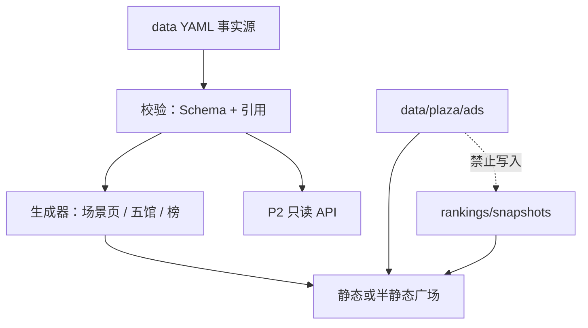

# Design: Digital Era Plaza

## Overview

广场是 world-professors 的产品层：用现有本体做地图，用新增 Person / Brand / Product / Ranking 做注意力与入驻对象，用 Tool 与场景页做调用与选型。实施上优先扩展数据与生成器，而不是先做独立 CMS。

## Steering Document Alignment

### Technical Standards (tech.md)

- YAML 编辑 + Pydantic/JSON Schema 校验
- Git 为权威历史
- 生成层：Jinja2 → Markdown/静态站（P0）；API 后置（P2）
- 付费与排名隔离视为安全需求，而非运营偏好

### Project Structure (structure.md)

```
data/plaza/
├── catalogs/                 # 受控词表
├── people/
├── brands/
├── products/
├── rankings/
│   ├── methods/
│   └── snapshots/
├── ads/                      # 精选位，禁止被排名读取
└── templates/
```

代码：`models/plaza.py`、`repositories/plaza_*.py`、`schemas/plaza-*.json`、生成器增加场景聚合页。

## Code Reuse Analysis

### Existing Components to Leverage

- **Scenario / Industry / Tool YAML 与 Repository**：场景页与工具库直接复用
- **Agent / Workflow / Capability**：行业资产库视图
- **校验服务（规划中的 DataValidator）**：引用完整性扩展到 plaza refs
- **Wiki 生成器（规划中）**：场景页模板增加「广场短名单」区块

### Integration Points

- 场景页成为聚合根：查询 `coordinates.scenarios` 命中的 Person/Brand/Product 与 `applicable_scenarios` 命中的 Tool
- `StandardLibrary` 设想扩展 `list_plaza_entities(scenario_id)`
- 广告目录即使为空也要在校验中被排名模块 ignore-list

## Architecture



### Modular Design Principles

- Person/Brand/Product 各一文件一实体
- RankingMethod 与 Snapshot 分离
- 广告模块不得 import 排名分数写入函数

## Components and Interfaces

### PlazaCatalog

- **Purpose:** 受控词表加载（品类、组织类型、来源类型）
- **Interfaces:** `get_product_categories()`, `validate_enum(field, value)`
- **Reuses:** 现有 YAML loader

### PlazaRepositories

- **Purpose:** 扫描 `data/plaza/**/*.yaml`
- **Interfaces:** `get(id)`, `list_by_scenario(scenario_id)`, `list_claimed()`
- **Reuses:** BaseRepository

### RankingService

- **Purpose:** P2 根据 Method 与公开信号生成 Snapshot；P0 只读取编辑快照
- **Interfaces:** `load_snapshot(id)`, `latest(scope, entity_type, method)`
- **Restriction:** 无 AdsRepository 依赖

### SceneAssembler

- **Purpose:** 为场景页组装资产 + 五馆短名单
- **Interfaces:** `assemble(scenario_id) -> ScenePlazaView`
- **Reuses:** ScenarioRepository, Tool repo, plaza repos

### ClaimWorkflow（P1）

- **Purpose:** 认领工单；v0 可用 GitHub Issue 模板代替代码
- **Interfaces:** 提交、审核、写回 `claim` 字段

## Data Models

详见 `docs/plaza/04-data-model.md`。摘要：

- Person: persona_type, coordinates, sources, claim, score bands
- Brand: org_type, region, products, coordinates
- Product: category, brand_ref, scenario fit, implements_tools
- RankingMethod / RankingSnapshot
- Tool / Scenario 增加可选 `plaza` 元数据

## Error Handling

1. **损坏引用：** 校验失败，CI 红；生成器跳过该边并在报告列出。
2. **覆盖不足：** 页面渲染空态，不回退到全局热门。
3. **认领冲突：** 同一实体两个申请时人工裁决，保留两份材料哈希。
4. **方法与快照不匹配：** 拒绝发布；不得静默用旧权重解释新榜。

## Testing Strategy

### Unit

- Schema：缺场景锚点、缺来源、数字人格缺披露
- 引用解析
- 广告条目不会出现在 snapshot loader 的 entries

### Integration

- 旗舰场景 `assemble()` 返回现有金融或科技种子 + 示例广场实体
- `wp validate`（实现后）包含 `data/plaza`

### Content

- 每个正式示例 YAML 必须通过校验夹具
